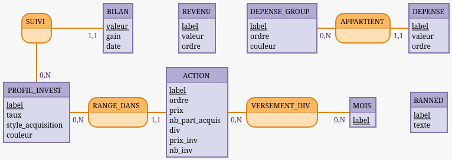

# mycount

App mobile de comptabilité personnelle (budget, investissements). Stack : Expo (React Native, TypeScript), React Navigation, SQLite (via `expo-sqlite`) pour le stockage local.

Reconstruction from scratch — logique redéfinie via MCD, l'ancien code n'est gardé que comme référence. Version 1.0 : les quatre écrans (Accueil, Investir, Suivi, Projection) sont fonctionnels, avec sauvegarde/restauration locale.

## Structure

- `backup/` — ancien repo mycount (référence, non repris tel quel)
- `maquette/` — export du prototype visuel : captures d'écran (`screen-01.png`…`screen-10.png`) et code d'export (`budget-app.dc.html`, `ios-frame.jsx`, `support.js`)
- `docs/` — documentation de conception (`mcd.png` : modèle conceptuel de données validé)

## Modèle de données

MCD
```text
SUIVI, 0N PROFIL_INVEST, 11 BILAN
BILAN: valeur, gain, date
REVENU: label, valeur, ordre
DEPENSE_GROUP: label, ordre, couleur
APPARTIENT, 11 DEPENSE, 0N DEPENSE_GROUP
DEPENSE: label, valeur, ordre

PROFIL_INVEST: label, taux, style_acquisition, couleur
RANGE_DANS, 0N PROFIL_INVEST, 11 ACTION
ACTION: label, ordre, prix, nb_part_acquis, div, prix_inv, nb_inv
VERSEMENT_DIV, 0N MOIS, 0N ACTION
MOIS: label
BANNED: label, texte
```



Entités principales :

- **REVENU** — revenus mensuels (liste éditable)
- **DEPENSE_GROUP** → **DEPENSE** (1,1 / 0,N) — catégories de dépenses et leurs postes
- **PROFIL_INVEST** → **ACTION** (1,1 / 0,N) — enveloppes d'investissement (PEA, Compte-titres, Crypto, Obligations) et leurs positions. `style_acquisition` détermine si l'utilisateur saisit `nb_inv` (quantité achetée/mois) ou `prix_inv` (montant investi/mois) ; `nb_part_acquis` est le stock déjà détenu, distinct de `nb_inv`.
- **ACTION** ↔ **MOIS** via **VERSEMENT_DIV** (N,N) — mois de versement de dividende par action
- **PROFIL_INVEST** → **BILAN** (1,1 / 0,N) — suivi mensuel par enveloppe (`valeur`, `gain`, `date`). Le bilan annuel se calcule par agrégation, non stocké.
- **BANNED** — notes libres de la page Investir, indépendantes, sans lien avec les autres entités

Rendement estimé (dividende/prix) : calculé à l'affichage, jamais stocké.

## Architecture technique

Pas de backend prévu pour l'instant : app mono-utilisateur, usage local sur un seul appareil.
Persistance via **SQLite embarqué** (`expo-sqlite`), les tables reprennent directement les entités du MCD — permet les jointures/agrégations (totaux mensuels, projections) en SQL plutôt qu'en JS. `AsyncStorage` (dépendance historique du repo) n'est pas adapté à ce modèle relationnel — à retirer au profit de `expo-sqlite`.

Un backend ne deviendra pertinent que si la synchronisation multi-appareils est souhaitée (aujourd'hui non spécifiée) — dans ce cas, prochaine étape naturelle : API Go + SQLite/Postgres, ou simplement synchroniser le fichier SQLite via un stockage cloud existant, sans logique serveur.

## État

Version 1.0 (2026-07-28) : MCD validé, schéma SQLite en place, les quatre écrans (Accueil, Investir, Suivi, Projection) sont implémentés. Sauvegarde/restauration locale du fichier de données via `src/utils/backup.ts`. Build Android natif (`expo prebuild`) fonctionnel — APK debug/release générables via Gradle.
